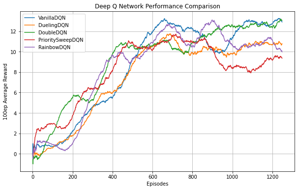

# Project Report

## Introduction
For this problem, we had to solve the `Banana` Navigation problem, where an agent has to collect as many yellow bananas as possible, while also avoiding blue bananas. This had to be done using Value-methods. As a personal objective, I wanted this project to be an opportunity to explore all the flavors of DQN mentioned in the course, as well as to develop a framework for building modular agents. I believe I was capable of reaching all the goals.

## Implementation
The agent's main code is written in `dqn_agent`. This contains the important pieces for an agent to be considered DQN. It was implemented so that implementation details, like the actual network, value estimation computation, and experience replay memory were interchangeable at runtime. This allowed me to easily build different implementations of each piece, while retaining the main logic behind the agent the same.

The following is a brief explanation of all the modular pieces implemented for this project:
### Networks
The neural networks reside in the `networks` folder. This networks must follow the `nn.Module` interface. The network is used by the agent to compute the action values of a state. This folder contains two implementations:
- **Vanilla:** A basic feed-forward neural network
- **Dueling:** A feed-forward neural network with two final branches for computing the state value and the action advantage

### Value Estimators
The value estimators, as the name says, computes the estimated value for an experience tuple using both the local and target networks. Having an interface for this allows me to separate the bellman update computation from the agent's logic. This folder contains two implementations:
- **Vanilla:** Basic Q Learning update. The target network is used to both choose and evaluate the next best action
- **Double DQN:** The local network is used to choose the next best action, while the target network is used to evaluate this decision.

### Experience Replay
The experience replay contains different implementations of how to store and retrieve experience tuples. It contains two implementations:
- **Memory Buffer:** The vanilla implementation of the experience replay. It retrieves experience uniformly at random.
- **Priority Buffer:** It uses the TD error to give priority to certain experience tuples.

## Shared details
To make comparisons between agents, most of the hyperparameters were fixed. Here is a list of those hyperparameters:
- **Episodes:** `1250`
- **Max Steps:** `1e8`
- **Epsilon:** `0.2`
- **Epsilon Decay:** `1e-5`
- **Gamma:** `0.99`
- **Hidden Layers:** `[128, 128, 64, 64, 64, 32, 32]`
- **Learning Rate:** `1e-4`
- **Alpha:** `0.001`
- **Batch Size:** `64`
- **Train Every:** `4` timesteps

## Results
The following plot demonstrates the 100-episode average reward for all the trained models.

From the plots above, we can conclude a few things:
1. Performance is relatively the same for all agents
2. In terms of reaching the highest amount of average reward, VanillaDQN and DoubleDQN appear to excel, with RainbowDQN reaching but not staying in the top.
3. In terms of stability, DoubleDQN appears to increase in a relatively stable manner. PrioritySweepDQN seems really unstable, reaching the lowest average reward near the end of the learning period.
4. Training time was exponentially higher for agents using PrioritySweepMemory. This may be an implementation detail

**NOTE**: Checkpoints for all models, as well as their performance, has been saved in the `checkpoints` folder.

## Next Steps:
This are some points that could be improved to get better insights and improve results:
1. Run multiple instances of all the agents to get a more robust performance metric. Comparing performance between single execution of each agent is really prone to noise influencing the conclusions.
2. Optimize PrioritySweepMemory. Currently it uses deque for storing experience. This, and the fact that we have to sort experience every n steps, may be the cause of loss in performance. Implementations with numpy or similar could greatly improve execution time.
3. Implement solutions from raw pixels. This should not be too hard, as the only difference is the input to the neural networks, and some architecture changes to deal with images (CNNs)